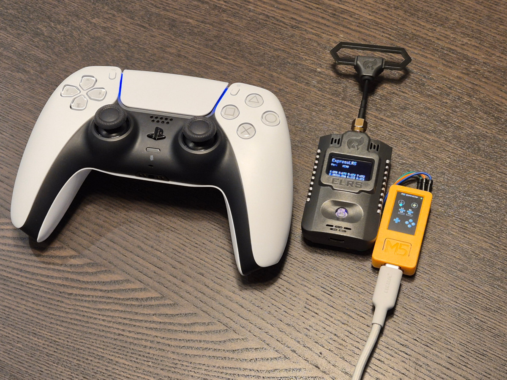
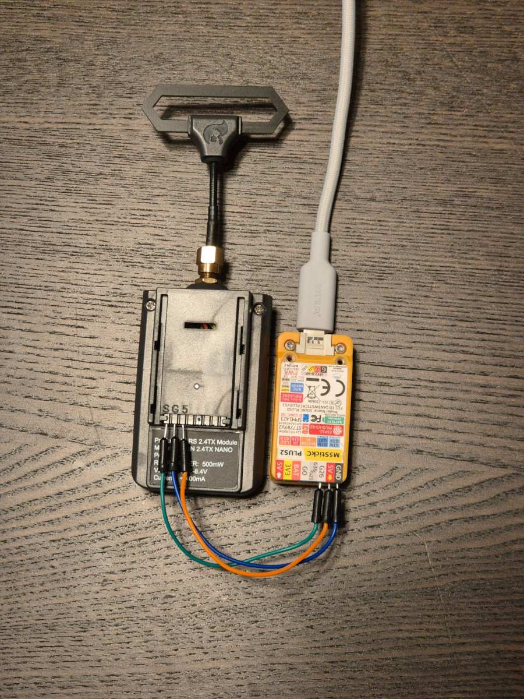

# PS5 Controller to CRSF Bridge for M5StickC Plus2

**Connect your PlayStation 5 (PS5) controller wirelessly to any RC system using the Jumper AION 2.4TX NANO and M5StickC Plus2!**

---

## Overview

This project transforms M5StickC Plus2 into a wireless bridge, allowing you to use a PS5 controller as a high-quality, ergonomic RC transmitter. It connects to the Jumper AION 2.4TX NANO module via CRSF protocol, making it ideal for FPV drones, RC cars, and robotics enthusiasts who love the feel of the DualSense controller.

- **No soldering required** (just simple jumper wires)
- **Intuitive on-screen menus** for setup and connection
- **Ergonomic, modern control** for your RC models
- **Open source and community-driven**

---

## Features

- **Wireless PS5 Controller Support:** Use your DualSense controller for precise, comfortable control.
- **CRSF Protocol Output:** Compatible with Jumper AION 2.4TX NANO and other CRSF receivers.
- **Easy Bluetooth Pairing:** Scan and connect to your PS5 controller directly from the M5StickC Plus2 screen.
- **Channel Mapping:** All major sticks, triggers, and buttons are mapped to CRSF channels.
- **Persistent Device Storage:** Remembers your controller for instant reconnection.
- **Visual Feedback:** On-screen status, channel activity, and connection indicators.

---

## Hardware Requirements

- **M5StickC Plus2** (ESP32-based microcontroller with display)
- **Jumper AION 2.4TX NANO** (or compatible CRSF TX module)
- **Sony PlayStation 5 DualSense Controller**
- **Jumper wires** (female-to-female recommended)

---

## Wiring Guide

Connect the M5StickC Plus2 to the Jumper AION 2.4TX NANO as follows:

| M5StickC Plus2 Pin | AION 2.4TX NANO Pin | Purpose         |
|--------------------|---------------------|-----------------|
| G26                | TX PIN 0            | CRSF TX (data)  |
| G                  | TX PIN 1            | Ground (GND)    |
| 5V OUT             | TX PIN 2            | Power (5V)      |

- **G26** is GPIO 26 on the M5StickC Plus2 (CRSF TX output)
- **G** is any ground pin
- **5V OUT** is the 5V output pin on the M5StickC Plus2

> **Tip:** Use short, high-quality jumper wires for best signal integrity.

---

## Setup & Usage

1. **Flash the Firmware**
   - Use PlatformIO or Arduino IDE to upload the firmware to your M5StickC Plus2.
   - Power up the device.

2. **Initial Boot**
   - The M5StickC Plus2 will display a logo, then enter the Bluetooth connection menu.

3. **Pairing Your PS5 Controller**
   - Put your PS5 controller into pairing mode: Hold the **PS** and **Create** buttons until the light bar flashes rapidly.
   - On the M5StickC Plus2, select **[SCAN FOR DEVICES]**.
   - Wait for your controller to appear (usually as "DualSense" or "Wireless Controller").
   - Select your controller from the list. The device will save the MAC address for future use.
   - Once connected, the status screen will show **CONNECTED**.

4. **Using the Controller**
   - Move the sticks, press triggers and buttons—channel activity is shown on the display.
   - The CRSF signal is sent to the AION 2.4TX NANO, which transmits to your RC receiver.

5. **Reconnecting**
   - On future boots, the device will auto-connect to your saved controller.
   - To clear the saved device, use the **[CLEAR SAVED DEVICE]** option in the Bluetooth menu.

---

## Channel Mapping

| PS5 Control         | CRSF Channel | Notes                |
|---------------------|--------------|----------------------|
| Left Stick X        | 0            | Roll                 |
| Right Stick Y       | 1            | Pitch                |
| Left Stick Y        | 2            | Throttle (0-127 up)  |
| Right Stick X       | 3            | Yaw                  |
| L1                  | 4            | AUX1 (toggle/moment) |
| R1                  | 5            | AUX2 (toggle/moment) |
| L2 (Analog)         | 6            | AUX3 (0-255)         |
| R2 (Analog)         | 7            | AUX4 (0-255)         |
| Cross (X)           | 8            | AUX5                 |
| Circle (O)          | 9            | AUX6                 |
| Square (□)          | 10           | AUX7                 |
| Triangle (△)        | 11           | AUX8                 |
| D-Pad Up            | 12           | AUX9                 |
| D-Pad Down          | 13           | AUX10                |
| D-Pad Left          | 14           | AUX11                |
| D-Pad Right         | 15           | AUX12                |

- **Button modes** (toggle/momentary) can be configured in firmware.
- All channels use CRSF standard values (172–1811).

---

## Use Cases & Ergonomics

- **FPV Drones:** Enjoy precise, fatigue-free flying with the DualSense controller's comfort and accuracy.
- **RC Cars & Robots:** Use familiar, modern controls for creative robotics or vehicle projects.
- **Accessibility:** Ideal for users who find traditional RC transmitters uncomfortable or difficult to use.

---

## Troubleshooting

- **Controller Not Found?**
  - Ensure your PS5 controller is in pairing mode (hold PS + Create until fast flashing).
  - Make sure no other device is connected to the controller.
  - Try rescanning from the Bluetooth menu.

- **No CRSF Output?**
  - Double-check wiring (G26 → TX0, G → TX1, 5V OUT → TX2).

- **Resetting Saved Device**
  - Use the **[CLEAR SAVED DEVICE]** option in the Bluetooth menu to forget the paired controller.

---

## Community & Credits

- **Project by [CrossTieConnect](https://github.com/CrossTieConnect)**
- Inspired by the open-source RC and FPV community
- Contributions, issues, and feature requests are welcome!

---

## License

MIT License. See [LICENSE](LICENSE) for details.
